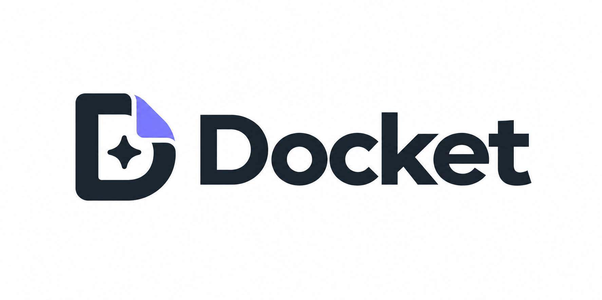

<p align="center">
  
</p>

<p align="center"><em>A per-commit evidence record for agent-written code.</em></p>

---

## Why

More and more of the code in a repository is written by a coding agent, often running in auto mode. The agent reads the code, picks an approach, edits, runs the tests, fixes what failed and hands back a finished diff. Along the way it made decisions and ran checks that the developer never saw.

The developer still owns that code. They have to explain it in review, fix it when it breaks and decide whether to trust it. Without knowing what the agent tried, what it verified and which lines nobody ever looked at, that is hard to do.

The agent harness already records all of this. It is thrown away when you commit. Docket keeps it: it reads the session, matches it against the diff, and stores a signed evidence record for each commit. You can then see, for any hunk or any line, who wrote it, why, what was tried before it, and what tested it.

```
$ docket show HEAD

docket 7a9da95a2a748c2fb99706f48f2ddf64760ffab2
  record     sha256:046c5278e93cb516e3ba72400fd1a69648c85b93833d31d57648e9ed8e535ebf
  trust      local_claimed (signed on local)
  verified   digest and signature check out (ed25519:f889a26cbc34c95e)

  1 hunks in 1 files, 4 added lines
  100% of added lines attributed to a recorded edit
  mean evidence density 0.77

src/auth.js:3-6 (4 lines)  covered  density 0.77
  origin      claude-code/main via Edit (reported by the harness)
              claude-opus-5
  task        Fix session fixation on login
  intent      The raw UUID is reused across logins, so minting a prefixed id instead.
  attempt     Stamping a creation time on the session so expiry can be checked. [superseded]
              vitest failed after this change: npx vitest run
  evidence    coverage: 4 of 4 lines executed (coverage/coverage-final.json)
  evidence    test_execution: pass (npx vitest run --coverage) — failed before this change
  human       no recorded human contact with these lines — the edit was written without a prompt (claude-code acceptEdits)
```

There is no account and no network access. The records live in your repository on an orphan ref, `refs/docket/records`.

---

## Install

Docket is a single static binary. On macOS or Linux:

```sh
curl -fsSL https://raw.githubusercontent.com/Dillonsmart/docket/main/install.sh | sh
```

On Windows, or if you would rather not pipe to `sh`, download the archive for your platform from [the releases page](https://github.com/Dillonsmart/docket/releases) (macOS, Linux and Windows, arm64 and x86-64), unpack it and put `docket` on your PATH. Each release publishes `SHA256SUMS`, and the installer checks the download against it.

To build from source:

```sh
go install github.com/Dillonsmart/docket/cmd/docket@latest
```

### Try it first

```sh
scripts/demo.sh
```

This creates a throwaway repository in a temp directory with a recorded agent session in it. The agent fixes a session fixation bug, gets it wrong once, sees a test fail, fixes it properly, and also edits a second file through the shell, which the transcript does not record. It then prints the docket for the commit so you can see both kinds of hunk. Your own repositories are not touched and the directory is deleted on exit. It needs `docket` on your PATH, or `DOCKET=/path/to/docket`.

### Set up a repository

```sh
docket init
```

This installs:

- a `prepare-commit-msg` git hook, which builds the record and writes its digest into the commit message as a trailer,
- a `post-commit` git hook, which stores the record on `refs/docket/records`,
- a fetch refspec for `refs/docket/*` on `origin`, so `git fetch` brings records down (`docket push` sends them up; if there is no remote yet, run `docket init` again once there is),
- a local signing key in `.git/docket/`,
- Claude Code `PreToolUse`/`PostToolUse` hooks in `.claude/settings.local.json`, so docket can see edits the agent makes through the shell. That is the per-machine file, not the committed `settings.json`: the hook names the path to the binary on this machine.

The hooks never block a commit. If docket is missing or the record cannot be built, the commit goes through and the error is written to `.git/docket/docket.log`.

From then on each commit gets one extra trailer line, alongside `Signed-off-by` and `Reviewed-by`:

```
    Add the session helper

    The API needs a stable id per session, and the obvious place is here
    rather than in the middleware.

    Reviewed-by: Someone Else <someone@example.com>
    Docket: sha256:db77fdb4b0c1fc6cc7644d3fa2204267e25799d74a6f8f665aff3d32b12c39af
```

That is the only change to your history. Subject lines and `git log --oneline` are untouched, and the trailer names a record in the repository rather than a URL, so it does not depend on any service staying up.

Some cases to know about:

- **Amend** rebuilds the record and replaces the trailer, so a commit never points at a record for content it no longer has.
- **Merges** get no trailer, and neither does a commit with nothing attributable in it.
- **Rebase and cherry-pick** do not run `prepare-commit-msg`, so the trailer is copied onto a diff it was not built from. `docket verify` reports this rather than trusting the trailer.

To stop using docket, delete the two hooks from `.git/hooks`. Existing trailers stay in the history as plain text.

### Upgrading

Re-run the installer and it replaces the binary in place:

```sh
curl -fsSL https://raw.githubusercontent.com/Dillonsmart/docket/main/install.sh | sh
```

`docket version` prints what you have. To pin a version, or to roll back, set `DOCKET_VERSION` on the `sh` side of the pipe:

```sh
curl -fsSL https://raw.githubusercontent.com/Dillonsmart/docket/main/install.sh | DOCKET_VERSION=v0.0.5 sh
```

From source, `go install github.com/Dillonsmart/docket/cmd/docket@latest` again. In CI, the action's default `version: latest` picks up the newest release on each run; pin it to a tag if you want to control when that happens.

Nothing needs migrating. Stored records carry the schema version they were written against and stay readable, and the only local state is the signing key, which upgrades do not touch. The hooks call the binary by absolute path and fall back to `docket` on PATH, so you only need to re-run `docket init` if you install to a new location and delete the old binary.

## Use it

```sh
docket show HEAD                      # the record for a commit, riskiest hunks first
docket build --staged                 # build a record for the staged change without committing
docket explain src/auth.js:51         # why does this line exist? (found via git blame)
docket review --format md             # the pull request comment
docket verify HEAD                    # check digest, signature and commit binding
docket push                           # send records to the remote
docket fetch                          # get records from the remote
docket doctor                         # what docket can and cannot see in this repo
docket gate --commits 20              # measure attribution against your own history
```

For pull requests, [the GitHub Action](action/) reads the records that came with the commits and posts one comment. It puts the hunks with no evidence first and collapses the well-covered ones underneath. It downloads the same binary, so nothing needs installing on the runner.

### Reading the reasoning back

Three fields answer "why does this code look like this":

- **task**: the request this edit came from, in the human's words.
- **intent**: what the agent said it was about to do, in the message immediately before the edit. This is the agent's reasoning in its own words.
- **attempt**: code that was written into this region and then removed, with the check that failed in between if there was one. These abandoned approaches are the part that is normally lost within hours.

```
$ docket explain database/migrations/0001_01_01_000000_create_players_table.php:54

database/migrations/…:54 was last written by be66f35c5977

  origin      claude-code/main via Edit
  task        Look at the engine plan for this project, challenge any assumptions then start implementing
  intent      Postgres `jsonb` normalises key order, so the replayed response wasn't byte-identical
              to the original. For a stored response we only ever return verbatim, `json` is the
              right column type.
  attempt     Now the schema. Replacing the default `users` table with `players` as the
              authenticatable model. [superseded]
```

`docket explain` uses `git blame` to find the commit, so you can start from the line in front of you rather than needing to know which commit to look in. `docket show <sha> --all --json` prints the whole record as JSON.

Docket stores short, redacted excerpts, not the conversation. That is enough to reconstruct the decision, and whole transcripts contain secrets and grow without bound.

---

## How it works

**Attribution.** Docket parses the agent transcript into an ordered stream of events, replays every recorded edit per file, and tracks an origin for each line through later edits. At commit time it lines up the committed file against that replay and resolves each hunk.

A line is only attributed to an edit when its text is found at the aligned position *and* in that edit's recorded output. Timestamps are used to order events, never to justify an attribution.

If an edit's recorded before-image disagrees with the replay, because a shell command, an editor or a person changed the file in between, docket marks the affected lines `unknown` and restarts the replay from the recorded content. It does not carry a guess forward. `unknown` is always an available answer and always comes with a reason, because a confidently wrong attribution is worse than none.

**Agents.** Docket reads sessions from Claude Code, Codex CLI and opencode. Everything after the reader is agent-agnostic, so adding an agent means adding a reader:

| Agent | Where its session lives | What docket gets from it |
|---|---|---|
| Claude Code | `~/.claude/projects/**/*.jsonl` (or `$CLAUDE_CONFIG_DIR`) | Edit/Write calls with before and after images, shell commands, prompts, the agent's narration |
| Codex CLI | `~/.codex/sessions/**/rollout-*.jsonl` | `apply_patch` calls, shell commands with exit codes, prompts, narration |
| opencode | `~/.local/share/opencode/opencode.db` (needs `sqlite3` installed) | write/edit calls with diffs, shell commands with exit codes, prompts, narration |
| anything else | — | point its hooks at `docket collect pre` and `docket collect post` and the edits are observed directly |

Codex and opencode send patches rather than whole files, so their edits have no before-image. Docket seeds the replay from the base revision and applies each patch to the content it was written against. When a patch does not fit, it re-seeds and marks what it cannot explain rather than guessing where the hunk goes.

**Observation.** Reading the transcript recovers `Edit` and `Write` calls. An agent that writes files through the shell (a heredoc, `sed -i`, a generator, a formatter) leaves nothing in the transcript to recover. So docket also watches the working tree: a `PreToolUse` hook snapshots the content, a `PostToolUse` hook diffs it, and both images are stored as git blobs. These edits are marked `observed` rather than `transcript`, because docket saw them itself.

**Evidence.** Test runs, type checks and static analysis are matched to the edits they followed. A check that ran *before* the code was written is not evidence about it. Coverage reports (istanbul `coverage-final.json` and lcov) are matched line by line against each hunk, and ignored when the report is older than the code.

**Human contact.** A terminal has no read receipts, so docket only claims what a harness recorded. `edited` means the harness saw the file change underneath it and these lines are among the ones that differed — line-accurate, from a recorded before-image. `approved` means the edit that wrote these lines went through a permission prompt: Claude Code's `default` mode, Codex's `untrusted` policy or a read-only sandbox. That is inferred from the setting in force, not observed, and a per-tool allow rule can silence a prompt the mode would otherwise show, so every record says what the claim rests on (`contact_basis`) and a reader can discount it. Everything else is `none`, with the basis saying whether the harness wrote without asking or the transcript simply does not say. opencode records nothing about permissions per call, so its edits are always the latter.

**Density.** Each hunk gets a score between 0 and 1. The formula is [published in the spec](spec/CER.md#6-evidence-density): coverage of the hunk's lines is worth up to 0.5, a check that passed after the edit 0.3 (0.35 if this change turned it green), type and static checks up to 0.1 together, recorded human contact up to 0.1. Then the caps: if nothing executed the code the score is capped at 0.15, if nobody can say who wrote it at 0.5, and a locally-claimed record scores 0.9 of a CI-attested one.

The caps matter. This number will end up being used as a target, the same way coverage was, and a score you can raise without running anything would be worthless.

---

## How well does attribution work

`docket gate` replays real sessions against real commits and reports what it could and could not explain. Measured so far:

| Session | Agent | Hunks in files the session edited | Added lines | Content-verified |
|---|---|---|---|---|
| A Laravel engine, Edit/Write tools (4 commits, 98 edits) | Claude Code | **98.1%** | 99.8% | 100% |
| A Python app, `apply_patch` (4 commits, 256 edits) | Codex CLI | **94.7%** | 95.7% | 99.8% |
| A FastAPI project, 100 edits (uncommitted, measured against the working tree) | opencode | — | **92.9%** | — |
| A PHP framework built largely through the shell (12 commits, 79 edits) | Claude Code | 59.2% | 82.1% | 100% |

Two things to take from this. Every attribution was checked against the crediting edit's own recorded output, so docket never credited a line to an edit that did not write it. And the last row is why the shell-edit hooks exist: those sessions wrote files with heredocs and `sed`, which no transcript records, before docket could observe them. With `docket init` in place, those edits are captured.

Across whole diffs the rate is lower (40%, 94% and 37% for the three committed sessions), because real commits also contain `composer.lock`, scaffolded models and generated code that no agent edit touched. Docket reports those as `unknown`, listing the commands that ran nearby as *candidates*. It does not count them as attributed.

Run it on your own history:

```sh
docket gate --commits 20
```

---

## What it is not

- Not orchestration, task assignment or agent spawning.
- Not agent-to-agent handoff or provider routing.
- Not a UI you live in. It annotates the review surface you already use.
- Not a live dashboard.
- Not something that asks for an account.

## Privacy

Transcripts contain raw prompts, file contents and terminal output, so:

- Everything that reaches a record goes through a redaction pass: private key blocks, known credential formats (AWS, GitHub, GitLab, Slack, Stripe, Google, OpenAI, Anthropic, npm), JWTs, authorization headers, credentials in URLs, `KEY=`/`SECRET=`/`PASSWORD=` style assignments, and any long token whose characters look random.
- A record stores short redacted excerpts, never whole files or whole prompts.
- Nothing is sent anywhere. Records live in your repository, and `docket push` sends them to the git host you already use.
- The signing key lives in `.git/docket/` and never leaves the machine.

## Trust

| Tier | Meaning |
|---|---|
| `local_claimed` | Built on a developer machine and signed with a key that machine holds. It is a claim. |
| `ci_attested` | Built by a CI runner and signed with a key the developer does not hold. Set `DOCKET_SIGNING_KEY` in CI. |

The tier is part of the schema and shown wherever a record is rendered.

## The format

The record format is specified separately as the [Commit Evidence Record](spec/CER.md), with a [JSON Schema](spec/cer-0.1.schema.json). Docket is the reference implementation. The spec is Apache 2.0 and written to be implemented by other tools.

## Status

Working: attribution, the shell-edit hooks, redaction, signed records on an orphan ref, coverage and test correlation, the terminal viewer, `explain`, the pull request comment, the GitHub Action, and `gate`.

Not built yet: readers for Gemini CLI and anything ACP-native, coverage formats beyond istanbul and lcov, GitLab, cross-repository aggregation, policy gates on paths, and a hosted team tier.

## Licence

Apache 2.0. See [LICENSE](LICENSE) and [NOTICE](NOTICE).
